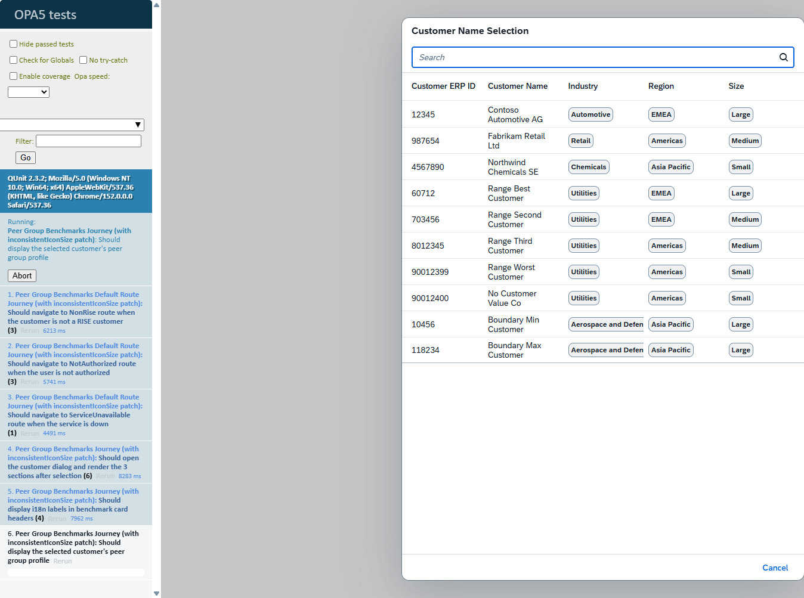

# Wallbox-Local (Shelly 1PM Gen1) — Guide de Configuration et Intégration

Ce document explique comment configurer le firmware Wallbox-Local via l’interface Web intégrée, à quoi servent les champs, et comment intégrer la wallbox dans Home Assistant (HA) avec MQTT.

Chemin du projet (Windows): C:\\Users\\I058304\\HomeAssistant\\shelly-ocpp-wallbox

—

## 1. Présentation

- Appareil: Shelly 1PM Gen1 (ESP8266 + BL0937/HLW8012)
- Firmware: Mongoose OS
- Nom d’application (OTA): `Wallbox-Shelly1PM` (inévitable pour l’OTA stock)
- Fonctionnement: local-only (pas d’OCPP), contrôle via UI (RPC), métriques via MQTT, auto-découverte HA
- Sécurité: HTTP Digest (realm `wallbox`), utilisateur `admin`; mot de passe par défaut `wallbox` — à changer

—

## 1bis. Aperçu (capture d'écran de l'UI)

Pour illustrer la page de configuration, vous pouvez ajouter une capture d'écran.

- Placez votre image à l'emplacement suivant (Windows):
  - C:\\Users\\I058304\\HomeAssistant\\shelly-ocpp-wallbox\\docs\\images\\wallbox-ui-overview.png
- Ce dépôt affichera l'image via le lien ci-dessous (relatif pour GitHub):



Conseil pour produire la capture: ouvrez la page http://<ip-de-la-wallbox>/, connectez-vous (HTTP Digest), dépliez les sections (Wi-Fi, MQTT, Firmware, Administration) et capturez l'écran complet afin de montrer les champs et actions disponibles.

—

## 2. Accéder à l’interface Web de la Wallbox

1) Connectez la wallbox à votre réseau Wi-Fi (ou en AP/hotspot la première fois)
2) Ouvrez votre navigateur sur:
   - `http://wallbox.local/` (mDNS), ou
   - `http://<ip-de-la-wallbox>/` (ex: `http://192.168.1.57/`)
3) Le navigateur demande une authentification HTTP Digest:
   - Utilisateur: `admin`
   - Mot de passe: `wallbox` (par défaut). Changez-le après installation.

—

## 3. Contrôles et champs de l’UI

L’UI est structurée en sections: Informations, Wi-Fi, MQTT, Firmware, Administration, Logs.

### 3.1 Informations (lecture seule + actions)

- Status: État du relais (Charging/Idle)
- Power: Puissance active instantanée (W)
- Voltage: Tension secteur (V)
- Current: Courant (A; 2 décimales)
- EV detected: Présence détectée du véhicule (hystérésis EV) — voir §7
- Energy delivered: Énergie de la session en cours (Wh)
- Intensity: Intensité calculée (A) — issue du delta d’énergie et du temps à 230 V
- Temperature: Température interne (°C)
- Device/Serial/IP/MAC/Uptime: Informations système

Actions:
- Start charge: Ferme le relais (démarre la charge) — `Wallbox.SetRelay {on:true}`
- Stop charge: Ouvre le relais (arrête la charge) — `Wallbox.SetRelay {on:false}`
  - À l’arrêt, les compteurs d’énergie sont persistés immédiatement (sécurité en cas de coupure)
- Reset energy: Remet à zéro les compteurs d’énergie — `Wallbox.ResetEnergy`

### 3.2 Wi-Fi (configuration)

Vous pouvez configurer jusqu’à deux réseaux (lieux différents):
- Network 1 / Network 2:
  - SSID: nom du réseau
  - Password: mot de passe du réseau (bouton “Show password” pour visibilité)
- Sauvegarde: bouton “Save” pour appliquer — la wallbox bascule automatiquement vers un réseau disponible

Remarques:
- En cas de perte du Wi-Fi (station disconnect), le timer de sécurité est désarmé automatiquement pour éviter des coupures intempestives.
- “Reset Wi-Fi” (section Administration) efface les stations et réactive le mode AP pour reprovisionnement.

### 3.3 MQTT (configuration)

Le broker MQTT est optionnel pour l’UI, mais nécessaire pour Home Assistant (données et auto-découverte):

- Enable: cochez pour activer la publication MQTT
- Server: adresse et port du broker (ex: `192.168.1.10:1883`, ou `mqtt://192.168.1.10:1883`)
- User: (optionnel) identifiant du compte sur le broker
- Password: (optionnel) mot de passe du compte
- Save: enregistre et applique la configuration

Remarques:
- Le Last Will & Testament (LWT) est configuré pour publier `offline` sur `wallbox/<id>/availability` en cas de déconnexion.
- La découverte HA est activée par défaut (`mqtt.ha_discovery=true`).

### 3.4 Firmware (OTA)

- Update: chargez le fichier `build/fw.zip` pour mettre à jour le firmware
- Authentification: l’endpoint `/update` requiert HTTP Digest (`admin`, `wallbox`) — utilisez un navigateur ou:
  ```bash
  curl -v --digest -u admin:<motdepasse> -F file=@build/fw.zip http://<ip-de-la-wallbox>/update
  ```
- Succès: le dispositif redémarre automatiquement

### 3.5 Administration

- Reboot: redémarre l’appareil (désarme le timer de sécurité avant reboot)
- Reset Wi-Fi: efface la config Wi-Fi (réactive l’AP), redémarre
- Factory Reset: réinitialise la configuration (niveau vendor), redémarre

### 3.6 Logs

- Téléchargez les fichiers de logs via la section Logs (liens listés si disponibles)

—

## 4. Intégration avec Home Assistant (HA)

### 4.1 Prérequis

- Un broker MQTT (ex: Mosquitto)
  - HA Add-on “Mosquitto broker” ou un broker externe
  - Créez un utilisateur dédié (ex: `wallbox`) et un mot de passe
- Intégration MQTT dans HA (Paramètres -> Appareils & Services -> Ajouter intégration -> MQTT)
- Auto-découverte HA activée (par défaut dans HA)

### 4.2 Mise en service

1) Configurez MQTT dans l’UI de la Wallbox (section MQTT): Enable, Server, User/Password
2) Redémarrez la Wallbox si nécessaire (Administration -> Reboot)
3) Vérifiez que HA découvre automatiquement la Wallbox (nouvel appareil et entités) via Home Assistant Discovery

### 4.3 Entités HA attendues

Entités publiées via MQTT Discovery (toutes retained):
- Sensors:
  - `power` (W) — mesure instantanée
  - `voltage` (V)
  - `current` (A)
  - `energy` (Wh) — énergie de la session
  - `temperature` (°C)
  - `uptime` (s) — state_class: total_increasing
- Binary sensors:
  - `charging` — reflète l’état du relais (Close/Open)
  - `ev` — détection EV via hysteresis (voir §7)
- Switch:
  - `relay` — commande Start/Stop via MQTT (topic `wallbox/<id>/cmd`)
- Availability:
  - `wallbox/<id>/availability` (online/offline)

### 4.4 Topics MQTT principaux

- `wallbox/<id>/state` — JSON métriques live:
  ```json
  {
    "uptime": 12345,
    "connected": true,
    "charging": false,
    "energy": 12.3,
    "intensity": 8,
    "tid": 0,
    "temperature": 45.6,
    "power": 3680,
    "voltage": 230,
    "current": 16.00,
    "ev": true
  }
  ```
- `wallbox/<id>/cmd` — commandes JSON:
  ```json
  { "action": "start" }
  { "action": "stop" }
  { "action": "reset_energy" }
  ```
- `wallbox/<id>/availability` — retained: `online` / `offline`

—

## 5. Sécurité

- HTTP/WS/MQTT protégés par HTTP Digest (`admin`, `wallbox` par défaut)
- UART/serial (port de service) reste ouvert (pas d’auth) — réservé aux usages locaux/atelier
- Recommandations:
  - Changez le mot de passe par défaut (fichier `fs/rpc_auth.htdigest`)
  - N’exposez pas l’UI sur Internet
  - Utilisez des identifiants dédiés sur le broker MQTT

—

## 6. Firmware OTA & Reset

- OTA: voir §3.4; après upload de `fw.zip`, l’appareil redémarre
- Reset:
  - Reset Wi-Fi: efface SSID/pass, réactive AP
  - Factory Reset: réinitialise la configuration (niveau vendor)
  - Reboot: redémarre

—

## 7. Détection EV (hystérésis)

- `ev` est calculé à partir de la puissance active:
  - EV présent si `power >= 150 W` sur 3 ticks consécutifs (1 tick ~ 60 s)
  - EV absent si `power <= 80 W` sur 3 ticks consécutifs
- Hystérésis pour éviter les oscillations et faux positifs
- `ev` est publié dans `state` et exposé côté HA (binary_sensor `ev`), et aussi disponible dans `Wallbox.GetInfo`

—

## 8. Dépannage

- `/update` renvoie 401:
  - Utilisez HTTP Digest: `--digest -u admin:<password>`
  - Assurez-vous que le navigateur relance la requête avec auth (Digest natif)
- L’UI charge mais tous les champs sont vides:
  - Attendu si vous n’êtes pas authentifié (Digest)
- HA ne découvre pas la Wallbox:
  - Vérifiez la connexion au broker MQTT, `mqtt.enable` et `mqtt.server`
  - Vérifiez que HA Discovery est activé
  - Consultez les logs de HA et de la Wallbox
- `docker: command not found` en build:
  - Lancez les commandes dans WSL (`wsl -e bash -lc '...'`) comme décrit dans `docs/BUILD-AND-FLASH.md`

—

## 9. Références

- Guide build/flash: `docs/BUILD-AND-FLASH.md`
- Plan d’implémentation: `docs/PLAN-L2-B-L3.md`
- Documentation RPC: `doc/rpc.md`
